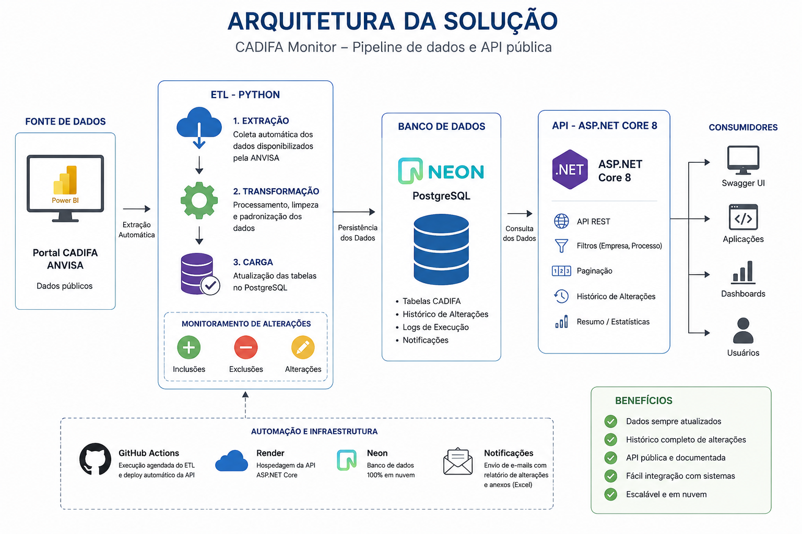
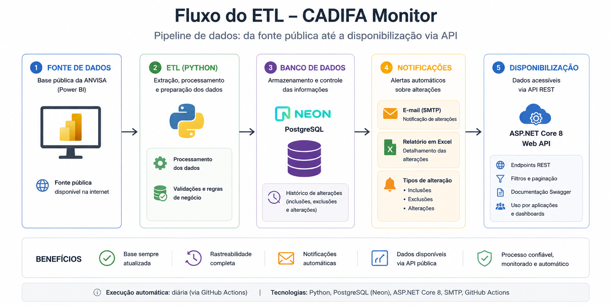
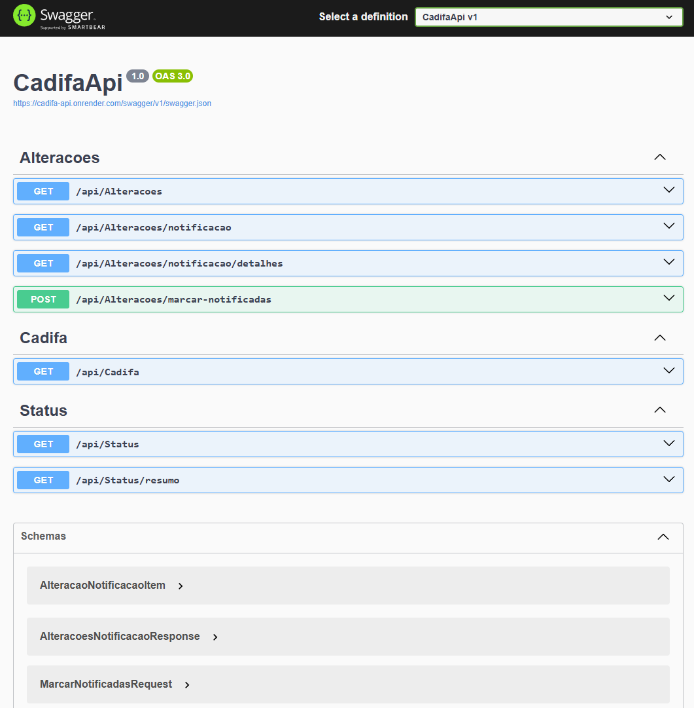
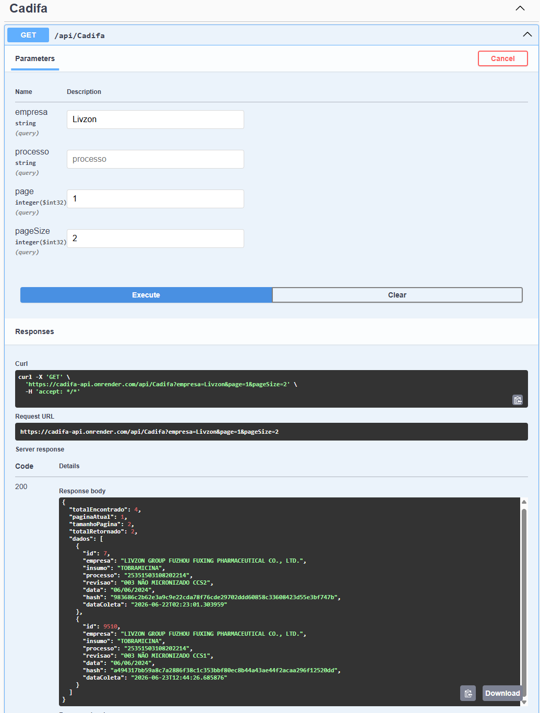
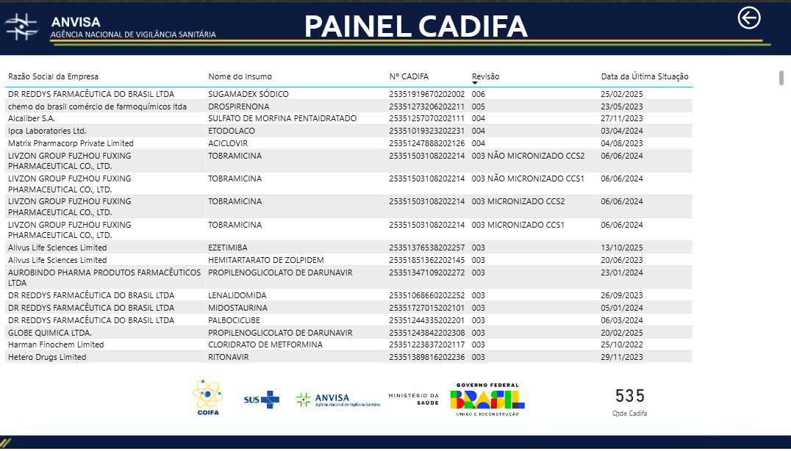
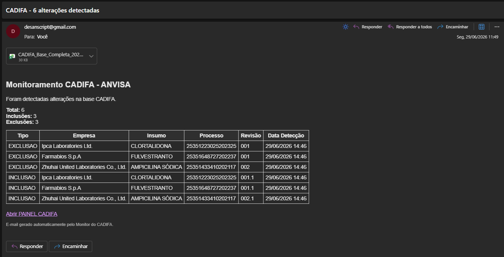

# API de Monitoramento CADIFA

[](https://cadifa-api.onrender.com/swagger)


>Plataforma de monitoramento regulatório baseada em dados públicos da **ANVISA**, composta por um **ETL automatizado em Python**, banco de dados **PostgreSQL (Neon Cloud)** e uma **API REST desenvolvida em ASP.NET Core 8** para disponibilização pública dos registros do CADIFA.

---

# Visão Geral

O projeto automatiza todo o fluxo de atualização do **Cadastro de Insumos Farmacêuticos Ativos (CADIFA)** disponibilizado pela ANVISA através de um painel público do Power BI.

O pipeline realiza:

- Extração automática dos dados
- Interpretação da estrutura comprimida do Power BI
- Atualização do banco PostgreSQL
- Histórico de alterações
- Disponibilização dos dados por API REST
- Atualização automática via GitHub Actions

---

# Problema

O acompanhamento do CADIFA pelo site PORTAL CADIFA normalmente exige consultas manuais e sem a possibilidade natural de exportação dos dados.

Este projeto automatiza completamente esse processo, permitindo que aplicações consultem uma base sempre atualizada através de uma API REST.

---

# Arquitetura



---

# Componentes da Solução

| Projeto | Responsabilidade |
|----------|------------------|
| **CADIFA_ETL** | Extração, parser Power BI, atualização do banco, monitoramento de alterações |
| **CADIFA_API** | API REST pública para consulta dos registros CADIFA |

---
# Fluxo ETL



---

# Demonstração

## Swagger

[CADIFA API Swagger](https://cadifa-api.onrender.com/swagger)



## Consulta por empresa

[Exemplo por empresa](https://cadifa-api.onrender.com/api/cadifa?empresa=Livzon)



## Portal oficial CADIFA

[Portal CADIFA](https://app.powerbi.com/view?r=eyJrIjoiOTQwZDZjZWEtNzUwNy00MTdhLTk3ZDEtN2VhNDM2ZDNhMTEzIiwidCI6ImI2N2FmMjNmLWMzZjMtNGQzNS04MGM3LWI3MDg1ZjVlZGQ4MSJ9)



## Exemplo de Recebimento do E-mail


---

# Tecnologias

| Camada | Tecnologia |
|----------|------------|
| Backend | ASP.NET Core 8 |
| Linguagem | C# |
| ORM | Entity Framework Core |
| Banco de Dados | PostgreSQL |
| Cloud Database | Neon |
| ETL | Python |
| Deploy | Render |
| Automação | GitHub Actions |
| Documentação | Swagger/OpenAPI |

---

# Principais Recursos

- ✅ Consulta pública dos registros CADIFA
- ✅ Parser da estrutura interna do Power BI
- ✅ Atualização automática do banco PostgreSQL
- ✅ Histórico de alterações
- ✅ Filtro por empresa
- ✅ Filtro por processo
- ✅ Paginação
- ✅ Endpoint de resumo
- ✅ Deploy público no Render
- ✅ Atualização automática via GitHub Actions

---

# Endpoints

## Status da API

```http
GET /api/status
```

---

## Resumo

```http
GET /api/status/resumo
```

### Exemplo

```json
{
  "totalCadifa": 537,
  "totalInclusoes": 3,
  "totalExclusoes": 3,
  "totalAlteracoes": 6,
  "ultimaAlteracao": "2026-06-22T20:05:00"
}
```

---

## Consultar CADIFA

```http
GET /api/cadifa
```

---

## Filtrar por empresa

```http
GET /api/cadifa?empresa=Livzon
```

---

## Filtrar por processo

```http
GET /api/cadifa?processo=25351
```

---

## Paginação

```http
GET /api/cadifa?page=1&pageSize=50
```

---

## Histórico de alterações

```http
GET /api/alteracoes
```

---

# Casos de Uso

- Automação de Acompanhamento de Sistemas regulatórios
- Integração com aplicações internas
- Desenvolvimento de aplicações terceiras

---

# Segurança

O processo responsável pela coleta e atualização automática dos dados (ETL Python) é mantido em repositório privado, pois contém detalhes técnicos relacionados à integração com a fonte pública.

---

# Roadmap

### Versão 1.2

- [x] Integração com PostgreSQL Neon
- [x] API ASP.NET Core 8
- [x] Swagger
- [x] Consulta de registros CADIFA
- [x] Filtros por empresa
- [x] Filtros por processo
- [x] Paginação
- [x] Monitoramento de inclusões
- [x] Monitoramento de exclusões
- [x] Histórico de alterações
- [x] Endpoint de resumo
- [x] Deploy público no Render
- [x] Agendamento automático do ETL
- [x] Notificação por e-mail quando houver alterações
- [x] Exportação para Excel (via e-mail)

### Próxima versão
- [ ] Dashboard web para consulta de histórico e serviço de assinatura

---

# Licença

Este projeto está licenciado sob a licença MIT.

---

# Autor

**Lucas Albuquerque**

Especialista em Desenvolvimento e Validação Analítica Farmacêutica e Desenvolvedor Backend .NET.

